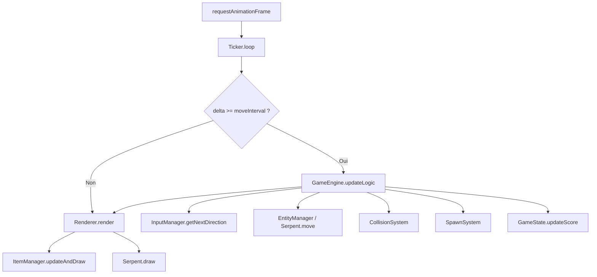

# 🐍 Dossier Technique Complet — Slither Arena

Ce document constitue la documentation technique de référence du projet Slither Arena. Il couvre l'intégralité de l'architecture, le détail de chaque module, les algorithmes utilisés, le travail de refactorisation effectué, et un script pour la soutenance orale.

**Version du dossier** : 1.1  
**Dernière vérification** : 2026-04-04  
**Périmètre validé** : `Game4-Slither-Arena/` (branche `main`)

---

## Table des Matières

1. [Présentation du Projet](#1-présentation-du-projet)
2. [Stack Technique](#2-stack-technique)
3. [Arborescence du Code Source](#3-arborescence-du-code-source)
4. [Architecture Logicielle](#4-architecture-logicielle)
5. [Point d'Entrée : main.js](#5-point-dentrée--mainjs)
6. [Le Moteur : GameEngine.js](#6-le-moteur--gameenginejs)
7. [Systèmes de Logique (logic/)](#7-systèmes-de-logique-logic)
8. [Gestionnaires (manager/)](#8-gestionnaires-manager)
9. [Entités (serpent/)](#9-entités-serpent)
10. [Fichiers Utilitaires](#10-fichiers-utilitaires)
11. [Interface HTML (index.html)](#11-interface-html-indexhtml)
12. [Travaux de Refactorisation](#12-travaux-de-refactorisation)
13. [Script de Présentation Orale](#13-script-de-présentation-orale)
14. [Exploitation et Runbook](#14-exploitation-et-runbook)
15. [Qualité, Tests et Limites](#15-qualité-tests-et-limites)
16. [Maintenance et Évolution](#16-maintenance-et-évolution)

---

## 1. Présentation du Projet

**Slither Arena** est un jeu web interactif de type "Snake" développé dans le cadre du TP GAME4 (MMI 2). Le joueur contrôle un serpent sur une grille 2D. L'objectif est de manger des pommes pour grandir tout en évitant les murs, son propre corps, et des serpents IA adverses qui apparaissent au fil de la progression.

Le jeu intègre un système de bonus (PowerUp d'invincibilité), des effets visuels (particules, pulsations, yeux directionnels), un tableau de scores persistant, et une interface responsive fonctionnant aussi bien au clavier qu'au tactile sur mobile.

---

## 2. Stack Technique

| Élément     | Technologie           | Détail                                      |
| ----------- | --------------------- | ------------------------------------------- |
| Langage     | JavaScript ES2022+    | Modules ESM, classes, arrow functions       |
| Build Tool  | Vite ^7.3.1           | Hot Module Reload, minification             |
| Rendu       | HTML5 Canvas API      | Contexte 2D, `requestAnimationFrame`        |
| Styling     | CSS3 Vanilla          | Variables CSS, media queries, glassmorphism |
| Typographie | Google Fonts (Outfit) | Poids 400, 600, 800                         |
| Persistance | localStorage          | Sauvegarde des 10 meilleurs scores          |

---

## 3. Arborescence du Code Source

```
Game4-Slither-Arena/
├── index.html                  # Structure HTML complète (Canvas, HUD, Modales, D-Pad)
├── README.md                   # Présentation du projet
├── package.json                # Dépendances et scripts npm
└── src/
    ├── main.js                 # Point d'entrée : bootstrap, HiDPI, lancement du moteur
    ├── style.css               # Feuille de style globale (Dark Mode, responsive, D-Pad)
    ├── constants.js            # Toutes les constantes du jeu (config, couleurs, taille grille)
    ├── utils.js                # Fonctions utilitaires (aléatoire, couleurs)
    └── modules/
        ├── GameEngine.js       # Orchestrateur central du jeu
        ├── logic/              # Systèmes de simulation pure (sans DOM)
        │   ├── Ticker.js            # Boucle de jeu et gestion du delta-time
        │   ├── GameState.js         # État d'une session (score, difficulté, pause)
        │   ├── EntityManager.js     # Registre des serpents (joueur + IA)
        │   ├── Terrain.js           # Grille 2D d'occupation des cellules
        │   ├── SpawnSystem.js       # Algorithme d'apparition des IA et PowerUps
        │   ├── CollisionSystem.js   # Détection et résolution de toutes les collisions
        │   └── Renderer.js          # Pipeline de rendu Canvas (grille, items, serpents)
        ├── manager/            # Couche d'interface et communication externe
        │   ├── InputManager.js      # Gestion centralisée du clavier (mapping d'actions)
        │   ├── InteractionManager.js# Pont entre le DOM (boutons, tactile) et le moteur
        │   ├── UIManager.js         # Manipulation du HUD et des overlays
        │   ├── ScoreManager.js      # Persistance des scores (localStorage)
        │   └── ItemManager.js       # Gestion des items (pommes, bonus) et particules
        └── serpent/            # Modélisation des entités du jeu
            ├── Anneau.js            # Segment atomique d'un serpent
            ├── Serpent.js           # Classe de base : joueur
            └── Serpent_ai.js        # Sous-classe : intelligence artificielle
```

---

## 4. Architecture Logicielle

Le projet suit le pattern **Orchestrateur Spécialisé** basé sur le principe de **Séparation des Responsabilités** (SoC).

### Principe Fondamental

Le `GameEngine` ne fait aucun calcul lui-même. Il ne dessine rien, ne détecte aucune collision, ne gère aucune touche. Il **délègue** chaque responsabilité à un système spécialisé et les coordonne via des callbacks.

### Les 3 Couches

- **Logic** : Simulation pure. Aucune référence au DOM. Contient le temps (`Ticker`), la physique (`CollisionSystem`), le spawn (`SpawnSystem`), l'état (`GameState`), le registre des entités (`EntityManager`), la grille d'occupation (`Terrain`) et le rendu (`Renderer`).
- **Manager** : Interface entre le code et le monde extérieur (DOM, clavier, écran tactile, localStorage).
- **Entity (serpent/)** : Les objets "vivants" du jeu. Gèrent leur propre état, leur propre mouvement et leur propre rendu.

### Flux d'une Frame

1. Le `Ticker` appelle `requestAnimationFrame` en boucle.
2. Si suffisamment de temps s'est écoulé (delta >= intervalle), il appelle `onTick` → `GameEngine.updateLogic()`.
3. `updateLogic()` récupère la direction du joueur via `InputManager`, déplace tous les serpents, vérifie les collisions via `CollisionSystem`, nettoie les entités mortes, synchronise la grille d'occupation (`Terrain`), puis gère la collecte d'items et les spawns.
4. À chaque frame (même sans tick logique), il appelle `onRender` → `Renderer.render()` qui efface le canvas, dessine la grille, les items, les particules, puis les serpents.

### Schéma d'Orchestration (Mermaid)



---

## 5. Point d'Entrée : main.js

`main.js` est le fichier de bootstrap. Il :

- Récupère le `<canvas>` et son wrapper depuis le DOM.
- Configure le rendu **HiDPI** : le canvas est redimensionné à `CSS_SIZE * devicePixelRatio` pour être net sur les écrans Retina, puis rescalé via `ctx.scale(dpr, dpr)`.
- Instancie le `GameEngine` avec le canvas.
- Affiche le menu d'accueil via `engine.ui.showMenu()`.
- Écoute la touche `F11` pour basculer en plein écran via l'API `Fullscreen`.

---

## 6. Le Moteur : GameEngine.js

### Rôle

Orchestrateur central. Il instancie tous les systèmes dans son constructeur et les relie par des callbacks.

### Constructeur — Instanciation des Systèmes

```
this.state          = new GameState()
this.terrain        = new Terrain(NB_CELLS)
this.renderer       = new Renderer(ctx)
this.ui             = new UIManager()
this.itemManager    = new ItemManager(NB_CELLS, this.terrain)
this.input          = new InputManager()
this.score          = new ScoreManager()
this.entities       = new EntityManager()
this.spawnSystem    = new SpawnSystem(this.itemManager)
this.collisionSystem = new CollisionSystem(this.itemManager, this.ui)
this.ticker         = new Ticker(onTick, onRender)
this.interactions   = new InteractionManager(systems, callbacks)
```

### Méthodes Principales

**`startGame()`** : Réinitialise l'état, la grille d'occupation (`Terrain`), les items et la file d'entrées. Crée un nouveau serpent joueur à la position (15,15), synchronise l'occupation, fait apparaître la première pomme, puis démarre le Ticker.

**`updateLogic(timestamp)`** : Cœur de la logique cadencée. Séquence :

1. Récupère la prochaine direction valide depuis `InputManager`.
2. Applique le changement via `joueur.changeDir(nextDir)`.
3. Boucle sur tous les serpents : déplace chacun, vérifie les collisions fatales.
4. Nettoie les entités mortes via `EntityManager.cleanup()` et synchronise la grille d'occupation.
5. Gère la collecte d'items, la mise à jour du score et le spawn des IA/powerups, puis resynchronise la grille.

**`togglePause()`** : Bascule l'état de pause. Met le Ticker en pause ou le reprend. Affiche ou cache le menu pause.

**`gameOver(message)`** : Arrête le Ticker, sauvegarde le score si > 0, affiche le menu de fin avec le message de mort.

**`_runSystems(timestamp)`** : Méthode privée qui gère la collecte d'items pour chaque serpent (avec la liste complète des serpents actifs), la mise à jour du score et de la difficulté, et le déclenchement du spawn d'IA et de PowerUps.

---

## 7. Systèmes de Logique (logic/)

### 7.1 Ticker.js — La Boucle Temporelle

Le Ticker sépare deux rythmes :

- **Tick logique** : Cadencé par un intervalle variable (ex: 100ms à 10 FPS → 50ms à 20 FPS). Cela garantit que le jeu ne va pas plus vite sur des écrans à 144Hz.
- **Render** : Appelé à chaque frame du navigateur (60+ FPS) pour des animations de particules fluides.

**Propriétés** : `animationFrameId`, `lastMoveTime`, `running`, `paused`.

**Méthodes** :

- `start()` : Lance la boucle, reset le timer.
- `stop()` : Arrête définitivement la boucle (`cancelAnimationFrame`).
- `pause()` / `resume()` : Suspendent/reprennent les ticks logiques sans arrêter le rendu.
- `setGetIntervalMethod(fn)` : Permet au GameEngine d'injecter dynamiquement la méthode de calcul de l'intervalle (qui dépend du score).
- `_loop(timestamp)` : Boucle interne. Calcule le delta-time, vérifie si l'intervalle est atteint, appelle `onTick` si oui, appelle `onRender` à chaque frame. Inclut une sécurité anti-lag : si le delta dépasse 1 seconde, le timer est réinitialisé.

### 7.2 GameState.js — L'État de Session

Centralise toutes les données volatiles d'une partie.

**Propriétés** : `score`, `fps`, `moveInterval`, `lastMoveTime`, `gameRunning`, `isPaused`, `_lastAISpawnScore`.

**Méthodes** :

- `reset()` : Remet tout à zéro pour une nouvelle partie. `fps` revient à `FPS_INITIAL` (10).
- `updateScore(newScore)` : Met à jour le score et recalcule la difficulté. La formule de vitesse est : `fps = min(FPS_MAX, FPS_INITIAL + floor(score / SCORE_FOR_SPEED_INCREASE))`. Concrètement, tous les 12 points, le jeu accélère d'1 FPS, jusqu'à un max de 20 FPS.
- `shouldSpawnAI()` : Retourne `true` tous les 10 points (configurable via `AI_SPAWN_SCORE_INTERVAL`). Utilise `_lastAISpawnScore` pour éviter les doublons.
- `togglePause()` : Inverse `isPaused`. Réinitialise `lastMoveTime` à la reprise pour éviter un "saut" temporel.

### 7.3 EntityManager.js — Le Registre des Entités

Gère la collection de serpents.

**Méthodes** :

- `init(joueur)` : Enregistre le joueur comme premier élément du tableau.
- `add(s)` : Ajoute un serpent (IA).
- `cleanup()` : Supprime les serpents morts, en préservant le joueur (pour l'affichage Game Over).
- `getAlive()` : Retourne les serpents vivants.
- `getAIs()` : Retourne tous sauf le joueur.

### 7.4 CollisionSystem.js — Le Système de Résolution des Impacts

Le système le plus complexe du projet. Gère les collisions fatales et la collecte d'items :

**`checkFatalCollisions(s, serpents, onGameOver)`** :

1. **Murs** : Vérifie si la tête est hors de la grille via `s.checkWallCollision(NB_CELLS)`. Si c'est le joueur → Game Over. Si c'est une IA → elle meurt silencieusement.
2. **Auto-morsure** : Vérifie si la tête chevauche un segment du corps via `s.checkSelfCollision()`.
3. **Autre serpent** : Compare la tête de `s` à tous les segments de chaque autre serpent.

**`_handleSerpentCollision(s, autre, serpents, onGameOver, timestamp)`** :
Gère la mécanique d'invincibilité. Si le joueur est invincible et percute une IA → l'IA est détruite avec effet de particules. Sinon → Game Over classique. Pour IA vs IA → l'attaquant meurt.

**`handleItemCollection(s, serpents, joueur, itemManager, scoreState, timestamp)`** :
Parcourt la liste des items à l'envers (pour pouvoir supprimer en parcourant). Si la tête d'un serpent est sur un item, traite l'effet.

**`_handleApple()`** : Joueur mange → +1 au score, serpent s'allonge, particules vertes, nouvelle pomme générée en évitant tous les serpents actifs. IA mange → -1 au score du joueur (pénalité).

**`_handlePowerUp()`** : Joueur mange → +5 au score, invincibilité pendant 8 secondes (`POWERUP_DURATION`). Serpent s'allonge, particules dorées.

### 7.5 SpawnSystem.js — Apparition des Entités et Bonus

**`checkSpawns(score, serpents)`** : Vérifie si un PowerUp doit apparaître. Conditions : au moins une IA vivante sur le terrain AND aucun PowerUp existant AND tirage aléatoire réussi (5% de chance par tick, configurable via `POWERUP_SPAWN_CHANCE`).

**`spawnNewAI(serpents)`** : Crée un nouveau `SerpentAI` de longueur 3, à une position et direction aléatoires, et l'ajoute au tableau.

**`spawnInitialItems(serpents)`** : Place la première pomme au démarrage.

### 7.6 Renderer.js — Le Pipeline de Rendu

**`clear()`** : Efface le canvas en entier puis dessine la grille de fond (petits points de 2x2 pixels aux intersections des cellules, couleur extraite de la variable CSS `--canvas-grid`).

**`render(state, itemManager, serpents, timestamp)`** : Appelle `clear()`, puis dessine les items et particules via `itemManager.updateAndDraw()`, puis dessine les serpents vivants via `s.draw()`.

---

## 8. Gestionnaires (manager/)

### 8.1 InputManager.js — Centralisation du Clavier

C'est le résultat du refactoring majeur du projet.

**Architecture** :

- **`keyMap`** : Objet dictionnaire mappant les touches clavier vers des directions numériques. Supporte ZQSD (FR), WASD (EN) et les flèches directionnelles.
- **`directionQueue`** : File d'attente des directions. Permet de "buffer" les entrées rapides sans en perdre.
- **`actions`** : Map de callbacks pour les touches non-directionnelles (P=Pause, I=Info, R=Restart).

**Méthodes** :

- `registerAction(key, callback)` : Enregistre un raccourci clavier. C'est LE point d'extensibilité du projet. Exemple : `input.registerAction('p', () => togglePause())`.
- `addDirection(dir)` : Pousse une direction dans la file (utilisé aussi par le D-Pad mobile).
- `getNextDirection(currentDirection)` : Dépile la file en filtrant les demi-tours (si direction actuelle=0/Haut, la direction 2/Bas est rejetée).
- `_setupListeners()` : Un unique `window.addEventListener('keydown')` qui dispatche soit vers le `keyMap` soit vers les `actions`.

### 8.2 InteractionManager.js — Le Pont DOM ↔ Moteur

Reçoit les références aux systèmes (`ui`, `state`, `input`, `score`) et aux callbacks (`onStart`, `onTogglePause`, `onRestartRequest`).

**`_initUI()`** : Lie chaque bouton HTML à son action via une fonction utilitaire `bind(id, fn)`. Gère le bouton principal du menu (Démarrer/Reprendre selon l'état), les boutons de restart, d'info, de leaderboard, de confirmation. Implémente aussi la fermeture par clic sur l'overlay.

**`_initKeyboard()`** : Utilise `InputManager.registerAction()` pour lier P → Pause, I → Info, R → Restart/Relancer.

**`_initMobile()`** : Configure le D-Pad. Pour chaque bouton directionnel (up/right/down/left), attache des listeners `touchstart`, `mousedown`, `touchend`, `mouseup`, `mouseleave`. Ajoute une classe CSS `is-active` pour le feedback visuel tactile. Appelle `input.addDirection(dir)` pour injecter la direction dans la file. Le fallback `click` est volontairement absent pour éviter les doubles entrées.

### 8.3 UIManager.js — Le Pilote du HUD

Récupère toutes les références DOM dans le constructeur (score, vitesse, menu overlay, boutons, modales).

**`updateHUD(score, fps)`** : Met à jour les compteurs en temps réel. La vitesse est affichée comme multiplicateur (ex: "1.5x").

**`showMenu(options)`** : Affiche l'overlay de menu. L'objet `options` permet de configurer titre, sous-titre, affichage du score, texte du bouton, et boutons optionnels (restart, debug).

**`showConfirm()` / `hideConfirm()`** : Gère la modale de confirmation avant restart.

**`showInfo()` / `hideInfo()`** : Gère la modale d'aide (contrôles et règles du jeu).

**`updateDebugButton(active)`** : Change la couleur et le texte du bouton Debug (vert=ON, rouge=OFF).

### 8.4 ScoreManager.js — Persistance des Scores

**`getScores()`** : Lit le localStorage, parse le JSON, retourne un tableau d'objets `{score, date}`. Gère les erreurs de parsing.

**`saveScore(value)`** : Ajoute un score, trie par valeur décroissante, conserve le top 10, écrit dans localStorage. Ignore les scores ≤ 0.

**`renderScoreboard()`** : Génère dynamiquement les éléments `<li>` du tableau des scores avec rang, date et valeur.

**`show()` / `hide()`** : Affiche/masque l'overlay du scoreboard.

**`clearScores()`** : Supprime la clé du localStorage et rafraîchit l'affichage.

### 8.5 ItemManager.js — Items et Particules

Contient deux classes : `Item` (objet sur la grille) et `ItemManager` (gestionnaire).

**Classe `Item`** :

- `draw(ctx, timeNow)` : Dessine l'item avec une animation pulsée. Les pommes utilisent `Math.sin(timeNow/150)` pour un effet de battement. Les PowerUps sont dessinés en losange avec un `shadowBlur` plus agressif.

**Classe `ItemManager`** :

- `spawnItem(type, serpents)` : Génère une position aléatoire en vérifiant les collisions avec tous les serpents et items existants, ainsi qu'avec la grille d'occupation dynamique (`Terrain`) (boucle do/while, max 500 tentatives).
- `spawnParticles(x, y, color)` : Crée 15 particules avec vélocité aléatoire, durée de vie `1.0` et décroissance variable.
- `updateAndDraw(ctx, timeNow)` : Dessine les items puis met à jour et dessine les particules (mouvement + alpha décroissant).

---

## 9. Entités (serpent/)

### 9.1 Anneau.js — Le Segment Atomique

La brique de base. Chaque anneau a une position (`i`, `j`) et une couleur.

**`move(d)`** : Déplace d'une case selon la direction (0=Haut→j-1, 1=Droite→i+1, 2=Bas→j+1, 3=Gauche→i-1).

**`copy(a)`** : Copie la position d'un autre anneau. C'est le mécanisme fondamental du mouvement en cascade.

### 9.2 Serpent.js — Le Joueur

**Constructeur** : Crée `longueur` anneaux empilés à la même position. Le premier est coloré en `snakeHead`, le dernier en `snakeTail`, les autres en `snakeBody`.

**`move()`** : Algorithme de glissement séquentiel. Pour k de fin à 1, l'anneau[k] copie la position de l'anneau[k-1]. Puis l'anneau[0] (tête) avance d'une case. Si invincible, la tête "wrap" à travers les murs (sortie à gauche → réapparition à droite).

**`changeDir(d)`** : Méthode d'encapsulation ajoutée lors du refactoring. Permet de changer la direction du serpent de manière contrôlée.

**`extend()`** : Ajoute un nouvel anneau à la position de la queue. Change la couleur de l'ancienne queue en `snakeBody`. Déclenche une pulsation visuelle.

**`draw(ctx, taille)`** : Dessine le serpent de la queue vers la tête. Chaque segment utilise `ctx.arc()` pour un rendu circulaire. La tête a des yeux (deux cercles blancs + pupilles noires) positionnés selon la direction. Si invincible, les segments brillent en doré avec un `shadowBlur` pulsé.

**`checkWallCollision(NB_CELLS)`** : Retourne `true` si la tête est hors limites (sauf si invincible).

**`checkSelfCollision()`** : Compare la tête à chaque segment du corps.

**`checkCollisionWith(autre)`** : Compare la tête à chaque segment d'un autre serpent.

**`isInvincible(timestamp)`** : Vérifie si `invincibleUntil` est dans le futur.

### 9.3 Serpent_ai.js — L'Intelligence Artificielle

Hérite de `Serpent`. Utilise une machine à 3 états :

**États comportementaux** :

- **Wander** (par défaut) : Direction aléatoire avec 10% de chance de changement par tick.
- **Rush** : Activé aléatoirement (10%). L'IA calcule le vecteur vers l'item le plus proche (priorité aux PowerUps) via distance de Manhattan.
- **Hunt** : Activé aléatoirement (15%). L'IA traque la tête du joueur pendant 40 ticks. Calcule la direction via `_getDirectionTo(from, to)` : compare les deltas X et Y, choisit l'axe dominant.

**Sécurité — Look-ahead à 1 case** :
Avant d'appliquer une direction, `_auditDirection()` simule la case suivante. `_isDirectionDangerous()` vérifie si cette case contient un mur, un segment de serpent, ou un item (en mode Wander uniquement, pour ne pas voler de pommes par accident).

Si la direction est dangereuse, `_getSafeDirection()` teste les 3 autres directions (en excluant le demi-tour) et en choisit une aléatoirement parmi les sûres.

**`move(items, allSerpents)`** : L'IA a une chance de ne pas bouger à chaque tick (`AI_MOVE_CHANCE = 0.9`), ce qui la rend légèrement plus lente que le joueur.

---

## 10. Fichiers Utilitaires

### constants.js

Toutes les constantes sont centralisées ici :

**Couleurs** (`COLORS`) : Extraites dynamiquement des variables CSS du document (`getComputedStyle`). Cela permet de changer le thème visuel uniquement via CSS.

**Configuration gameplay** (`GAME_CONFIG`) :

- `DEBUG_MODE: false` — Mode debug désactivé par défaut (activable via le bouton/menu).
- `FPS_INITIAL: 10` — Vitesse de départ (10 mouvements/seconde).
- `FPS_MAX: 20` — Vitesse maximale.
- `SCORE_FOR_SPEED_INCREASE: 12` — Points nécessaires pour accélérer de +1 FPS.
- `AI_SPAWN_SCORE_INTERVAL: 10` — Nouvelle IA tous les 10 points.
- `AI_MOVE_CHANCE: 0.9` — 90% de chance que l'IA bouge par tick.
- `AI_RANDOM_MOVE_CHANCE: 0.35` — Intensité de variabilité aléatoire des décisions IA.
- `POWERUP_SPAWN_CHANCE: 0.05` — 5% par tick.
- `POWERUP_DURATION: 8000` — 8 secondes d'invincibilité.
- `SCORE_APPLE: 1`, `SCORE_POWERUP: 5`, `SCORE_AI_PENALTY: -1`, `SCORE_KILL_AI: 5`.

**Grille** : `TAILLE_CELLULE = 20px`, `NB_CELLS = 30`, `CSS_SIZE = 600px` → grille de 30×30 cases de 20px.

### utils.js

- `getRandomInt(max)` : Entier aléatoire dans [0, max[.
- `getRandomColor()` : Couleur RGB aléatoire.

---

## 11. Interface HTML (index.html)

Le fichier HTML contient :

- Un **header** avec le titre, les compteurs vitesse/score, et les boutons Info et Leaderboard.
- Le **canvas** (600×600) dans un container.
- L'**overlay de menu** (titre, sous-titre, score final, boutons Démarrer/Debug/Restart).
- Le **D-Pad mobile** : grille 3×2 avec boutons ▲▼◀▶, visible uniquement sur petits écrans.
- La **modale de confirmation** (Oui/Annuler pour le restart).
- La **modale d'info** (contrôles ZQSD/flèches, touches P/R/I, règles du jeu).
- L'**overlay scoreboard** (liste ordonnée des meilleurs scores, bouton effacer).

---

## 12. Travaux de Refactorisation

### 12.1 Centralisation du Clavier (InputManager)

**Avant** : Les `keydown` listeners étaient dans plusieurs fichiers. Un gros `switch` dans `InputManager` gérait les directions ET les actions.
**Après** : Un seul listener, un `keyMap` pour les directions, et un système `registerAction()` pour les callbacks externes. Résultat : ajouter un raccourci = 1 ligne de code.

### 12.2 Allègement d'InteractionManager

**Avant** : Contenait de la logique clavier dupliquée et des `document.getElementById` répétitifs.
**Après** : Clavier délégué à `InputManager`. Fonction utilitaire `bind(id, fn)` pour simplifier les liaisons DOM.

### 12.3 Encapsulation `changeDir` (Serpent.js)

**Avant** : Le moteur modifiait directement `serpent.direction = newDir`.
**Après** : Passage par `serpent.changeDir(newDir)`. Conforme aux exigences du TP2 et au principe d'encapsulation POO.

---

## 13. Script de Présentation Orale

### Introduction (1 min)

"Bonjour. Je vous présente Slither Arena, un jeu Snake moderne développé en JavaScript ES6 avec l'API Canvas. L'objectif du projet était double : créer une expérience de jeu fluide et responsive, tout en mettant en pratique une architecture logicielle modulaire et maintenable."

### Architecture (2 min)

"Le cœur du projet est le GameEngine, un orchestrateur qui ne fait aucun calcul lui-même. Il délègue la physique au CollisionSystem, le temps au Ticker, et le rendu au Renderer. Cette séparation des responsabilités m'a permis d'ajouter des fonctionnalités complexes — comme une IA prédictive et un système de PowerUps — sans jamais altérer la logique de base.

Par exemple, le Ticker sépare la vitesse de simulation de la vitesse d'affichage, ce qui garantit un gameplay identique sur un écran 60Hz et un écran 144Hz."

### Refactoring et POO (2 min)

"J'ai effectué une refonte majeure des contrôles. J'ai centralisé la gestion du clavier dans un InputManager qui utilise un mapping d'actions. Cela permet d'enregistrer des raccourcis clavier en une seule ligne : `input.registerAction('p', callback)`. J'ai aussi encapsulé le changement de direction du serpent dans une méthode dédiée `changeDir`, conformément aux exigences du TP2 et aux principes de la POO."

### Mobile et Finalité (1 min)

"Le jeu est totalement responsive. Il fonctionne au clavier comme au tactile grâce à un D-Pad que j'ai optimisé pour les petits écrans. Les scores sont persistés via localStorage. Pour conclure, Slither Arena est un projet abouti qui démontre la maîtrise de la POO, des patterns d'architecture, et du développement web moderne."

---

## 14. Exploitation et Runbook

### Prérequis

- Node.js 20+ recommandé.
- npm 10+ (ou pnpm 9+ si préférence équipe).
- Navigateur moderne compatible Canvas (Chrome, Edge, Firefox).

### Installation

```bash
npm install
```

Alternative pnpm :

```bash
pnpm install
```

### Commandes Principales

```bash
# Lancer en développement
npm run dev

# Build de production
npm run build

# Prévisualiser le build
npm run preview

# Vérifier le lint
npm run lint
```

### Vérifications Rapides Avant Démo

1. Démarrage sans erreur console bloquante.
2. Contrôles clavier (ZQSD, WASD, flèches) opérationnels.
3. Contrôles tactiles (D-Pad) opérationnels sur viewport mobile.
4. Sauvegarde et affichage du leaderboard localStorage fonctionnels.

## 15. Qualité, Tests et Limites

### État Actuel Qualité

- Le projet est structuré de façon modulaire (moteur + systèmes + managers + entités), ce qui facilite les évolutions.
- Les scripts de test automatisés ne sont pas encore présents dans `package.json`.
- Un script `lint` ESLint est exposé et utilisable (`npm run lint`).

### Limites Connues

- Pas de batterie de tests unitaires/integration automatisée.
- Gameplay dépendant d'aléas (`Math.random`) sans seed déterministe pour reproduire exactement une partie.
- Le mode debug repose sur des logs console, sans panneau de télémétrie in-game.

### Améliorations Recommandées

1. Ajouter des tests unitaires ciblés pour `GameState`, `CollisionSystem` et `InputManager`.
2. Ajouter un contrôle CI simple (lint + build) sur chaque push/PR.
3. Introduire une stratégie RNG seedée pour les sessions de test/replay.

## 16. Maintenance et Évolution

### Checklist de Mise à Jour du Dossier

1. Vérifier l'arborescence réelle et synchroniser la section 3.
2. Vérifier les constantes de gameplay et synchroniser la section 10.
3. Vérifier les scripts disponibles dans `package.json` et synchroniser la section 14.
4. Mettre à jour la date de vérification en tête de document.

### Règle de Cohérence

Toute modification d'un module de `src/modules/` doit entraîner une mise à jour explicite de la section correspondante dans ce dossier pour conserver sa valeur de référence technique.

---
