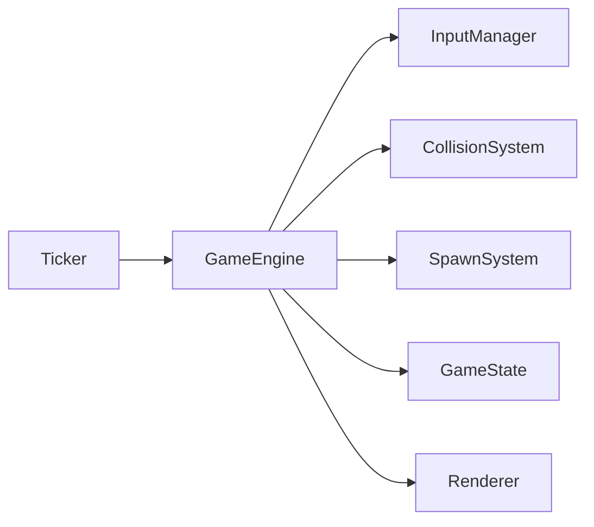

# Dossier Technique Court - Slither Arena

Version: 1.0  
Date: 2026-04-04  
Perimetre: Game4-Slither-Arena (branche main)

---

## 1. Resume du projet

Slither Arena est un jeu Snake web en JavaScript moderne.
Le joueur controle un serpent sur une grille 2D, collecte des pommes pour augmenter son score, evite les murs et son corps, puis affronte des serpents IA qui apparaissent avec la progression.

Fonctionnalites principales:

- Gameplay progressif (vitesse qui augmente avec le score)
- IA adverses (comportements Wander, Rush, Hunt)
- PowerUp d'invincibilite temporaire
- Effets visuels Canvas (particules, pulsations)
- Scoreboard persistant via localStorage
- Compatibilite clavier et mobile (D-Pad tactile)

---

## 2. Stack technique

- Langage: JavaScript ES Modules
- Rendu: HTML5 Canvas API
- Build/dev: Vite
- Styles: CSS3 (variables + responsive)
- Persistance: localStorage

Scripts NPM:

- npm run dev
- npm run build
- npm run preview
- npm run lint

---

## 3. Architecture en une minute

Le projet suit une architecture modulaire avec un orchestrateur central:

- GameEngine: coordonne tous les sous-systemes
- Logic: simulation pure (temps, collisions, spawn, rendu)
- Manager: interface avec DOM, clavier, tactile, stockage
- Entites: classes serpent joueur et serpent IA



---

## 4. Modules essentiels

- main.js: bootstrap, canvas HiDPI, lancement moteur
- GameEngine.js: boucle logique, pause, game over, orchestration
- Terrain.js: grille 2D d'occupation des cellules par les serpents
- Ticker.js: cadence logique + rendu fluide
- CollisionSystem.js: murs, auto-collision, collisions inter-serpents, items
- SpawnSystem.js: apparition IA et powerups
- InputManager.js: centralisation clavier + file de directions
- InteractionManager.js: pont DOM, boutons et controles tactiles
- ItemManager.js: pommes, powerups, particules
- Serpent.js / Serpent_ai.js: mouvement, rendu, IA

---

## 5. Equilibrage gameplay (valeurs clefs)

- FPS initial: 10
- FPS max: 20
- Acceleration: +1 FPS tous les 12 points
- Spawn IA: tous les 10 points
- Chance de spawn powerup: 5% par tick (si IA presente)
- Duree invincibilite: 8 secondes
- Scoring: +1 pomme, +5 powerup, -1 si une IA mange une pomme

---

## 6. Exploitation rapide

Prerequis:

- Node.js 20+
- npm 10+ (ou pnpm)

Installation:

```bash
npm install
```

Execution dev:

```bash
npm run dev
```

Build production:

```bash
npm run build
npm run preview
```

Checks avant demo:

1. Demarrage sans erreur bloquante
2. Controles clavier OK
3. D-Pad mobile OK
4. Scoreboard sauvegarde/restauration OK

---

## 7. Qualite actuelle et limites

Points forts:

- Bonne separation des responsabilites
- Code modulaire et lisible
- Documentation longue detaillee disponible

Limites:

- Pas de tests automatises integres
- Script lint disponible, mais pas de tests automatises executes en CI
- Aleatoire non seedee pour reproduire une partie a l'identique

---

## 8. Pitch oral ultra-court (45-60 sec)

"Slither Arena est un Snake moderne developpe en JavaScript avec Canvas. Son point fort est son architecture modulaire: le GameEngine orchestre des systemes specialises pour le temps, les collisions, le spawn et le rendu. Cette separation nous a permis d'ajouter une IA multi-comportements, un powerup d'invincibilite, des effets visuels et un support mobile tactile sans casser le coeur du jeu. Le projet est fonctionnel, maintenable, et pret pour une evolution vers des tests automatises et une CI qualite."
